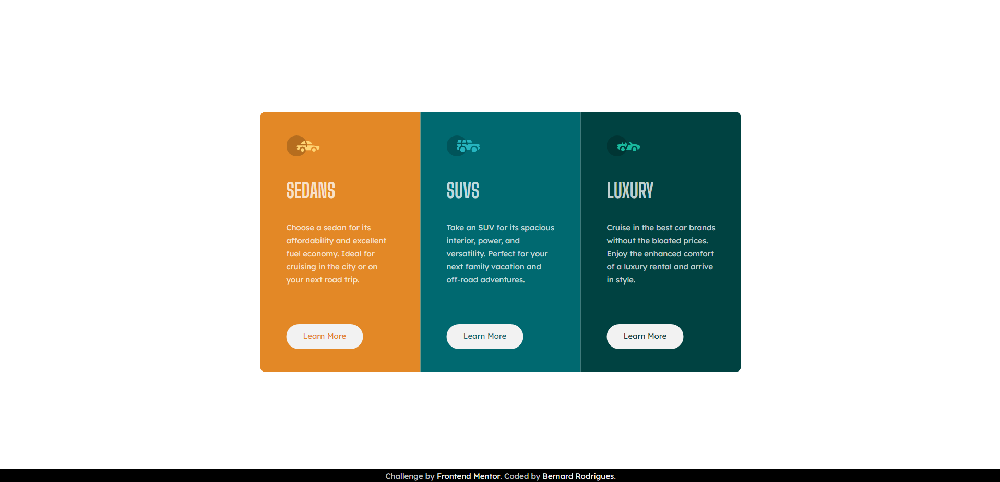

# Frontend Mentor - 3-column preview card component solution

This is a solution to the [3-column preview card component challenge on Frontend Mentor](https://www.frontendmentor.io/challenges/3column-preview-card-component-pH92eAR2-). Frontend Mentor challenges help you improve your coding skills by building realistic projects. 

## Table of contents

- [Overview](#overview)
  - [The challenge](#the-challenge)
  - [Screenshot](#screenshot)
  - [Links](#links)
- [My process](#my-process)
  - [Built with](#built-with)
  - [Useful resources](#useful-resources)
- [Author](#author)
- [Acknowledgments](#acknowledgments)

## Overview

### The challenge

Users should be able to:

- View the optimal layout depending on their device's screen size
- See hover states for interactive elements

### Screenshot

### Links

- Solution URL: [Add solution URL here](https://your-solution-url.com)
- [Live Site URL](https://frontendmentor-3column-preview-card-component.vercel.app/)

## My process

### Built with

- HTML5
- CSS3

### Useful resources

- [Tailwind](https://tailwindcss.com): I used TailwindCSS CSS output as example to reset my *style.css*.

- [Microsoft PowerToys](https://learn.microsoft.com/pt-br/windows/powertoys/): Used the screen ruler as a tool to measure the pixels from the reference pictures.

## Author

- Frontend Mentor - [@bernard-rodrigues](https://www.frontendmentor.io/profile/bernard-rodrigues)
- LinkedIn - [@bernard-rodrigues](https://www.linkedin.com/in/bernard-rodrigues/)

## Acknowledgments

I'd like to thank my friend [@caduovieira](https://github.com/caduovieira) who motivated me to participate in this challenge and made it with me.
